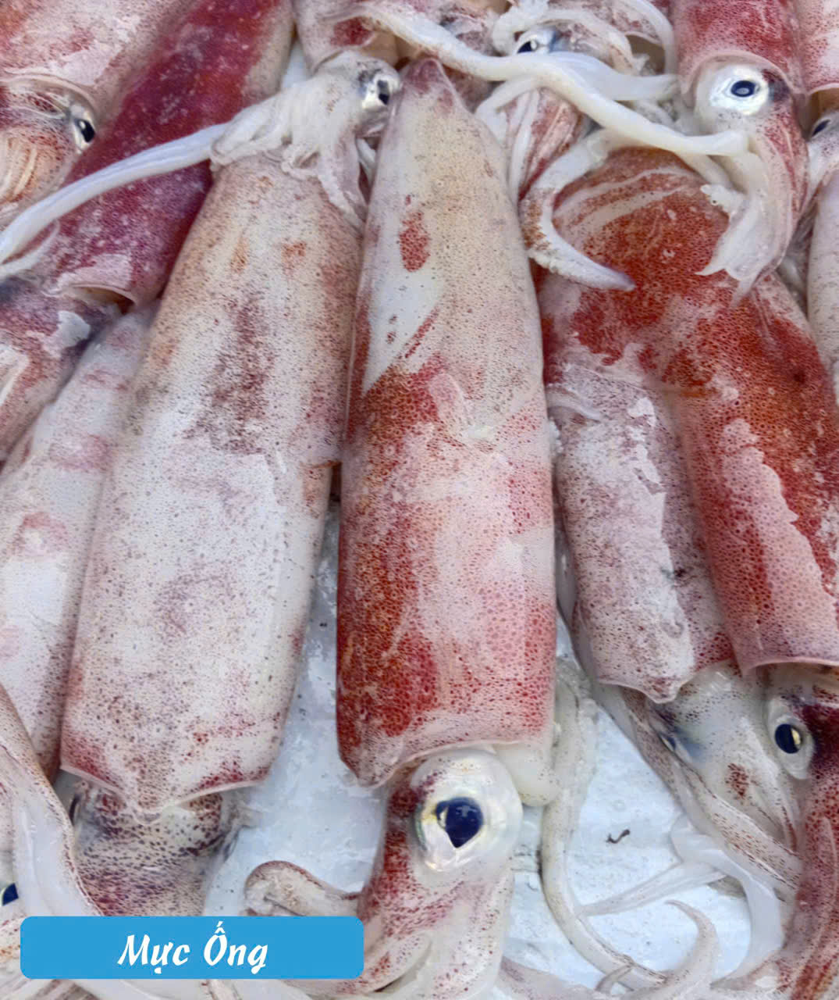

# Hải Sản Tươi Khánh Hòa mỗi ngày
## Shop chuyên bán hải sản tươi Khánh Hòa mỗi ngày
* Giá cập nhật ngày 31/3/2026 
* ☎️ 0973 885 426 
* Zalo: 0973 885426 
* [Biển-Hải sản tươi sống](https://www.facebook.com/share/p/1FZAy5NLFL/)

<h2 style="text-align:center;font-weight:bold; font-size:40px">Menu cá ngày 31/3/2026</h2>

|Tên cá| Hình ảnh |Giá Tiền|
|--------|----------|----------|
| Cá Bạc Má |  | 250.000đ |
| Cá Chỉ Vàng |  | 120.000đ |
| Cá Chim Biển Nhỏ |  | 90.000đ |
| Cá Chim Trắng |  | 180.000đ |
| Cá Cờ |  | 220.000đ |
| Cá Cơm Than |  | 220.000đ |
| Cá Dìa |  | 220.000đ |
| Cá Dưa Gang |  | 220.000đ |
| Cá Hố |  | 220.000đ |
| Cá Măng |  | 220.000đ |
| Cá Ngát |  | 220.000đ |
| Cá Nục |  | 220.000đ |
| Cá Phèn |  | 220.000đ |
| Cá Thu |  | 220.000đ |
| Cá Trác Vàng |  | 220.000đ |
| Mực Cơm |  | 220.000đ |
| Mực Lá |  | 220.000đ |
| Mực Ống |  | 220.000đ |

