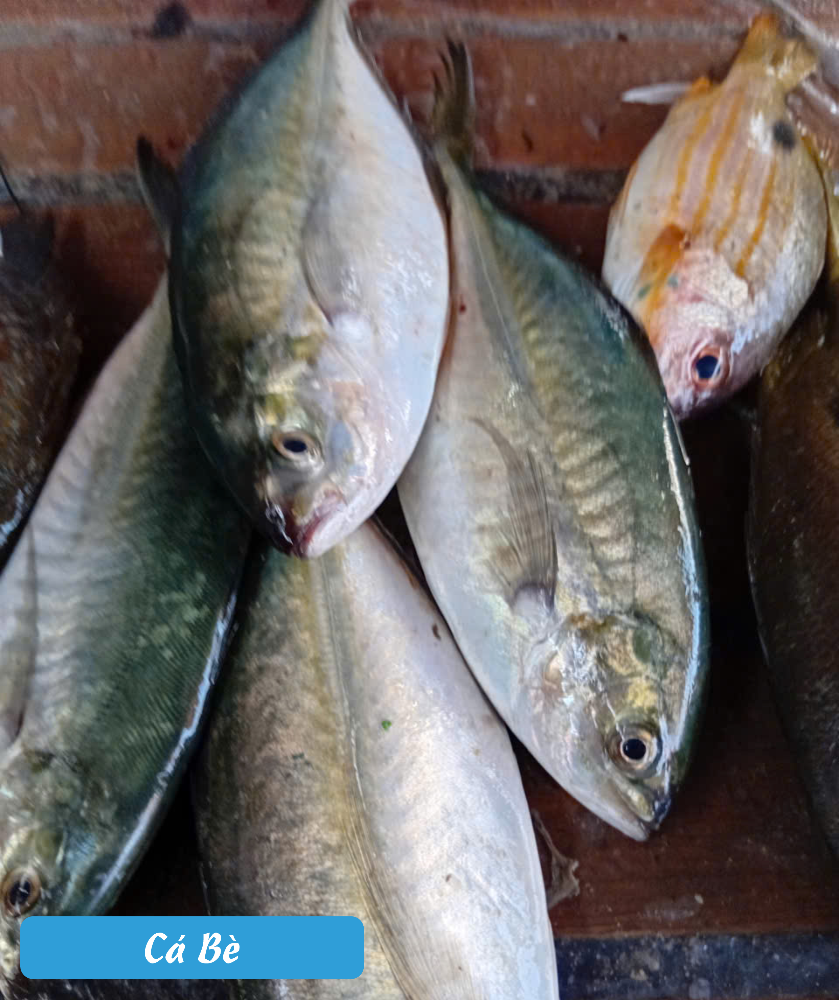

# Hải Sản Tươi Khánh Hòa mỗi ngày
## Shop chuyên bán hải sản tươi Khánh Hòa mỗi ngày
* Giá cập nhật ngày 1/4/2026 
* ☎️ 0973 885 426 
* Zalo: 0973 885 426 
* [Fanpage Facebook: Biển-Hải sản tươi sống](https://www.facebook.com/share/p/1FZAy5NLFL/)

<h2 style="text-align:center;font-weight:bold; font-size:40px">Menu</h2>

<table class="menu-table">
  <tr>
    <th>Tên Sản Phẩm</th>
    <th>Hình Ảnh Thực Tế</th>
    <th>Giá tiền(đ/kg)</th>
  </tr>

  <tr><td><strong style="font-size:1.15em;">Cá Bạc Má</strong></td><td></td><td><strong style="font-size:1.15em;">140.000đ</strong></td></tr>

<tr><td><strong style="font-size:1.15em;">Cá Chỉ Vàng</strong></td><td></td><td><strong style="font-size:1.15em;">160.000đ</strong></td></tr>

<tr><td><strong style="font-size:1.15em;">Cá Chim Biển Nhỏ</strong></td><td></td><td><strong style="font-size:1.15em;">190.000đ</strong></td></tr>

<tr><td><strong style="font-size:1.15em;">Cá Chim Trắng</strong></td><td></td><td><strong style="font-size:1.15em;">260.000đ</strong></td></tr>

<tr><td><strong style="font-size:1.15em;">Cá Cờ</strong></td><td></td><td><strong style="font-size:1.15em;">210.000đ</strong></td></tr>

<tr><td><strong style="font-size:1.15em;">Cá Cơm Than</strong></td><td></td><td><strong style="font-size:1.15em;">140.000đ</strong></td></tr>

<tr><td><strong style="font-size:1.15em;">Cá Dìa</strong></td><td></td><td><strong style="font-size:1.15em;">260.000đ</strong></td></tr>

<tr><td><strong style="font-size:1.15em;">Cá Dưa Gang</strong></td><td></td><td><strong style="font-size:1.15em;">200.000đ</strong></td></tr>

<tr><td><strong style="font-size:1.15em;">Cá Hố</strong></td><td></td><td><strong style="font-size:1.15em;">180.000đ</strong></td></tr>

<tr><td><strong style="font-size:1.15em;">Cá Măng</strong></td><td></td><td><strong style="font-size:1.15em;">150.000đ</strong></td></tr>

<tr><td><strong style="font-size:1.15em;">Cá Ngát</strong></td><td></td><td><strong style="font-size:1.15em;">190.000đ</strong></td></tr>

<tr><td><strong style="font-size:1.15em;">Cá Nục</strong></td><td></td><td><strong style="font-size:1.15em;">100.000đ</strong></td></tr>

<tr><td><strong style="font-size:1.15em;">Cá Phèn</strong></td><td></td><td><strong style="font-size:1.15em;">170.000đ</strong></td></tr>

<tr><td><strong style="font-size:1.15em;">Cá Thu</strong></td><td></td><td><strong style="font-size:1.15em;">280.000đ</strong></td></tr>

<tr><td><strong style="font-size:1.15em;">Cá Trác Vàng</strong></td><td></td><td><strong style="font-size:1.15em;">140.000đ</strong></td></tr>

<tr><td><strong style="font-size:1.15em;">Chả Nem</strong></td><td></td><td><strong style="font-size:1.15em;">170.000đ</strong></td></tr>

<tr><td><strong style="font-size:1.15em;">Mực Cơm</strong></td><td></td><td><strong style="font-size:1.15em;">340.000đ</strong></td></tr>

<tr><td><strong style="font-size:1.15em;">Mực Lá</strong></td><td></td><td><strong style="font-size:1.15em;">380.000đ</strong></td></tr>

<tr><td><strong style="font-size:1.15em;">Cá Bè</strong></td><td></td><td><strong style="font-size:1.15em;">Đang Cập Nhật</strong></td></tr>

<tr><td><strong style="font-size:1.15em;">Cá Dìa</strong></td><td></td><td><strong style="font-size:1.15em;">Đang Cập Nhật</strong></td></tr>

<tr><td><strong style="font-size:1.15em;">Cá Nhồng</strong></td><td></td><td><strong style="font-size:1.15em;">Đang Cập Nhật</strong></td></tr>

<tr><td><strong style="font-size:1.15em;">Cá Rốc</strong></td><td></td><td><strong style="font-size:1.15em;">Đang Cập Nhật</strong></td></tr>

<tr><td><strong style="font-size:1.15em;">Cá Sơn La</strong></td><td></td><td><strong style="font-size:1.15em;">Đang Cập Nhật</strong></td></tr>

</table>

